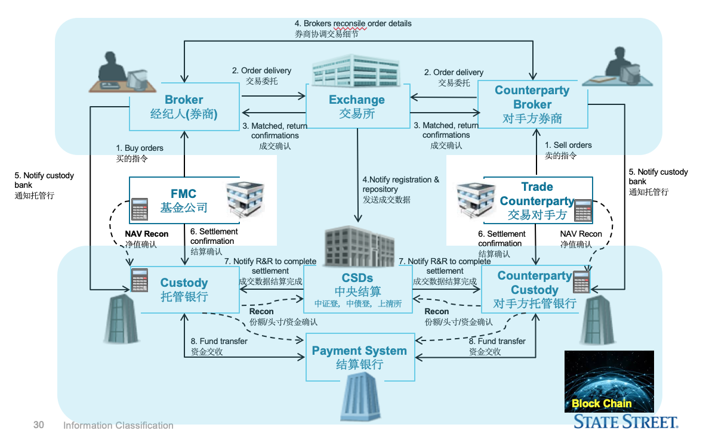

### PE/EPS

PE市盈率，=股价Price/每股年收益Earning。假如保持当前盈利能力，经过多少年能赚到当前股价那么多钱。PE越低，表示股价相对便宜。比如东方航空现在市盈率5.8倍，就意味着，如果维持2011年前三季度的赚钱能力，假如所有收益都用来分红的话，6年不到的时间，就可以通过分红回本。
​	EPS每股收益，=净利润/股本Earning per Share。每一股赚多少钱。还是以东方航空为例，它第三季的EPS为0.51，就意味着2011年前三季每股赚了0.51元。

PE是指股票的本益比，也称为“利润收益率”。本益比是某种股票普通股每股市价与每股盈利的比率。所以它也称为股价收益比率或市价盈利比率

- PB = 股价（price） / 账面价值（book value）

### 参与者的功能(托管行功能)

托管行是指负责保管、持有基金管理公司等投资机构从客户处募集到的资金，并对基金管理人使用这笔资金进行监管和对外披露信息的机构，通常由**商业银行**来担当。

共同基金的基金净值计算、投资方向是否符合规定、基金费用开支及收入等有关基金运作的安全性和合规性都需要托管行来监督。托管行在整个委托理财行业中(不论是公募还是私募)都是不可或缺的重要角色，不仅可以降低基金公司的资金管理成本，也可以保护投资者的利益。托管行对所提供服务会按照托管资金规模的一定比例来收取费用，通常在0.2%-0.25%之间，此费用由基金投资者承担。托管业务也成为商业银行积极争取的一项中间业务。

### 资本市场/货币市场/外汇市场特征

金融市场按照金融市场交易标的物划分为货币市场、资本市场、外汇市场、衍生品市场、保险市场和黄金市场。

资本市场通常是指由期限在**1年以上的各种融资活动**组成的市场，由于在长期金融活动中，涉及资金期限长、风险大，具有长期较稳定收入，类似于资本投入，故称之为资本市场。

货币市场是指以期限在**一年以内的金融资产交**易的市场。该市场的主要功能是保持金融资产的流动性，以便随时转换成可以流通的货币。它的存在，一方面满足了借款者的短期资金需求，另一方面为暂时闲置的资金找到了出路。货币市场一般指国库券、商业票据、银行承兑汇票、可转让定期存单、回购协议等短期信用工具买卖的市场。

外汇市场是指在国际间从**事外汇买卖**，调剂外汇供求的交易场所。它的职能是经营货币商品，即不同国家的货币。

### 原生产品/衍生品的概念

原生金融产品（underlying financialproducts），是指货币、外汇、债务性金融商品和所有权性金融商品等金融资产，以及这些金融资产价格的总称。包括货币、外汇、存单、债券、股票；以及利率或债务工具的价格、外汇汇率、股票价格或股票指数、商品期货价格等。(currencty、Foreign currency、Certificates of deposit、bond、stock）

衍生产品是一种金融工具，一般表现为两个主体之间的一个协议，其价格由其他基础产品的价格决定。并且有相应的现货资产作为标的物，成交时不需立即交割，而可在未来时点交割。典型的衍生品包括远期，期货、期权和互换等(forward future option swap)

Financial contract which derives its value from the performance of another entity such as an asset, called the "underlying".

远期，期货，期权，互换

### Broker（经理人）/Dealer（经销商）

Broker，中文翻译为经纪人或经纪商，它是通过为客户提供经纪服务来赚取交易佣金的方式获利的。它本身是不参与到交易中的，仅仅起到一个中介的作用(代客交易)，它是不具有所买卖财产的所有权的。

而Dealer，我们把它叫做坐市商或做市商，它的获利方式是用自有资金来买入证券，然后再以更高的价格卖给投资者，来赚取买卖价差。它会参与到整个交易过程中，是完全拥有所买卖的财产的所有权的。

在金融市场中，Broker和Dealer的作用主要体现在二级市场的交易过程中。Broker会参与到Order-driven markets中，尤其是在交易比较活跃时帮助买卖双方更快速的找到交易对手，能撮合的交易越多，它的收益也越多。Dealer主要是参与到Quote-driven markets，在市场交易不活跃时，扮演一个流动性提供者的角色，同时尽可能的获得比较高的买卖差价。

### Order和价格

- Limit Risks
  - 创建单个证券或商品定单的“篮子”，它能够作为一个整体被管理以及提交执行。在交易平台中自动地创建和保存篮子文件，或者使用Excel手动操作。使用交易平台篮子交易者来管理篮子，并自动地创建和维护客户化的基于指数的篮子。使用独立的指数交易者应用程序来创建和管理仅仅基于指数的篮子。
  - Basket（篮子）
  - Stop (触发指令)
  - Stop Limit(触发限价指令)
- Speed of Execution
  - Market(市价指令): A market order is an order to buy or sell an asset at the bid or offer price currently available in the marketplace 
  - Market If Touched (触价指令): An MIT (market-if-touched) is an order to buy (or sell) an asset below (or above) the market. This order is held in the system until the trigger price is touched, and is then submitted as a market order. An MIT order is similar to a stop order, except that an MIT sell order is placed above the current market price, and a stop sell order is placed below.  
  - Market On Open: A market order executed at the market's open at the market price.  
  - Market On Close: A market order executed at the market's close at the market price.  
  - Pegged to Market (挂钩市场)
  - VWAP 
- Price Improvement
- Discretion
  - 全权委托定单是一种限价定单，您对其定义一个任意的金额（将被添加到限价中或从限价中扣减），该金额会增大定单能够执行的价格范围。最初的限价被显示给市场。
  - 隐藏定单（通常是大交易量定单），既不在市场数据中也不在深层交易册中显示其存在。
  - 冰山指令是把一笔大单分成很多个小单，下达这些小单通常是使用程序化交易来实现，这样做的目的是为了隐藏其实际大单的数量。 
- Market Timing

### 债券价格/利率关系

票面利率大于到期收益率时，债券价格大于票面价格；

票面利率小于到期收益率时，债券价格小于票面价格。

票面利率一定时，债券价格与到期收益率呈反向变动。假设一个新债券发行，按100元本金出售，这个债券的票面利率就是市场利率。那么以前发行的事还在二级市场上流通的债券，如果那些债券的票面利率低于这个市场利率，必须降价才会有人买;而票面利率高于这个市场利率的债券，即使出售价格高于100，大家也会争着买。所以会说市场利率越高，债券越便宜。

### 股票概念

Securities representing shares of ownership in a corporation代表公司所有权的证券

一般股/优先股（固定收益）

Cumulative preferred stock可累积

Putable preferred stock强制回购

Participating Preferred Stock参与有限股

Prior Preferred Stock最优股

股票（stock）是股份公司发行的所有权凭证，是股份公司为筹集资金而发行给各个股东作为持股凭证并借以取得**股息和红利**的一种有价证券。每股股票都代表股东对企业拥有一个基本单位的所有权。每家上市公司都会发行股票。

同一类别的每一份股票所代表的公司**所有权是相等**的。每个股东所拥有的公司所有权份额的大小，取决于其持有的股票数量占公司总股本的比重。

股票是股份公司资本的构成部分，可以**转让、买卖**，是资本市场的主要长期信用工具，但不能要求公司返还其出资

### 财务报表市盈率(PE)

Price/Earning (P/E) Ratio
A valuation ratio of a company's current share price compared to its per-share earnings.

For example, if a company is currently trading at 43 a share and earnings over the last 12 months were 1.95 per share, the P/E ratio for the stock would be 22.05 (43/1.95). 


### 衍生品投资的目的(Hedge)

套期保值者hedger

is an investment position intended to offset potential losses/gains that may be incurred by a companion investment旨在抵消伴随投资可能产生的潜在损失/收益（对冲）

  Corporate/Banks, Financial Institutions to manage ALM and to hedge their proprietary positions/ Trade Business – Exporters and Importers企业/银行、管理ALM并对冲其自营头寸/贸易业务的金融机构——出口商和进口商

投机者 Speculators
以盈利为目的，捕捉市场动向
套利者 Arbitragers
利用两个或两个以上市场之间的差价的做法

### 权证/期权

权证（share warrant），是指基础证券发行人或其以外的第三人发行的，约定持有人在规定期间内或特定到期日，有权按约定价格向发行人购买或出售标的证券，或以现金结算方式收取结算差价的有价证券。

期权是指一种合约，该合约赋予持有人在某一特定日期或该日之前的任何时间以固定价格购进或售出一种**资产**的权利。

1.发行主体不同。期权没有发行人，每个投资者在有足够保证金的基础下，都可以卖出期权（类似于发行），期权的买卖双方都可以是普通的投资者。而权证的发行主体有严格的要求和实力，一般由上市公司或者券商，大股东等第三方作为发行人。

2.合约的当事人不同。期权合约的当事人是期权合约的买卖双方，期权的买方（权利方）与期权的卖方（义务方）是一一对应的。而权证的合约当事方是发行人与持有人。

3.合约特点。期权是一种在交易所上市交易的标准化合约，交易之前标的，合约单位，执行价，到期日等都是固定的。而权证是非标准化合约，合约要素由发行人确定。

4.理论上，期权供给数量可以是无限的，只要买卖双方可以达成成交，就可以创造出持仓量，而权证的供给是有限，在权证发行时基本上已经确定。受到发行人意愿，资金实力，上市流通的证券数量等因素限制。

5.投资者交易期权，除了可以买入期权合约，同时也可以卖出期权合约（双向操作）。在权证交易中，只由发行人才可以卖出权证收取权利金，投资者只可以买入权证（单向操作）。

6.履约担保。期权的卖出（义务方）因为要承担义务需要交纳保证金，期权的买方不用缴纳保证金，同权证市场中，投资者的地位是相同的。

7.行权价格的确定。期权市场上，行权价格的确定是由交易所根据一定规则确定。而权证的行权价格由发行人根据一定模型确定。

### 基金行业结构，作用和功能

MF player

MFC business

### 保证金交易

客户在买卖证券时仅向证券公司支付一定数额的保证金或交付部分证券，其应当支付的价款和应交付的证券不足时，由证券公司进行垫付，而代理进行证券的买卖交易

融资买入证券为"买空"，融券卖出证券为"卖空"。

保证金交易有杠杆作用，风险大、利润高。在我国，期货就属于保证金交易，还有现在银行开设的外汇保证金交易；保证金交易都是T+0，也就是可以当日买、卖多次，不受限制。

### 托管服务

基金托管是指商业银行接受基金管理人的委托，代表基金持有人的利益，保管基金资产，监督基金管理人日常投资运作，基金托管人独立开设基金资产账户，依据管理人的指令进行清算和交割，保管基金资产，在有关制度和基金契约规定的范围内对基金业务运作进行监督，并收取一定的托管费。

### 财务报表

- 资产负债表
- 利润表
- 现金流量表
- others: Earnings / Retained Earnings股东权益 / Return on Investment(ROI ) / Price/Earning (P/E) Ratio / 

### 基金净值计算

基金净值（通常称为单位净值）是当前基金净资产总额除以基金份额总额。基金累计净值怎么计算？一般来说，单位净值在每日（交易日，T日）的基础上波动，因为总资产和总份额是波动的。

公式：T天资金净值=（T天资金总资产 - T天资金总负债）/ T天发行资金总数

简而言之，净资产等于每只基金的价值。例如，华泰佩里量化单位的净单位价值为1.3910元，相当于每个华泰佩里基金的现值为1.3910元。如果您以1.0000元的价格买入，现在您将卖出（赎回），您将以1.3910元的价格进行交易，扣除原购买成本（无论基金费用，基金分红）。 0.3910元，相当于收益的39.1％。

### 主动/被动投资概念

动投资策略是指投资者在一定的投资限制和范围内，通**过积极的证券选择和时机**选择努力寻求最大的投资收益率。被动投资策略是指以长期收益和有限管理为出发点来购买投资品种，一般选取特定的指数成分股作为投资的对象，不主动寻求超越市场的表现，而是**试图复制指数的表现。**

### 基金募集说明书的内容

重点信息：

- 发行日期及发行人
- 投资目标
- 策略
- 风险/回报
- 费用和开支
- 过往表现(回程柱状图)
- 经理/顾问/组织
- 股东服务:再投资、赎回

投资目标——基金的目标在招股说明书中有明确规定。每个共同基金都有不同的目标。一个基金的目标可能是保持资本的收益，而另一个基金的目标可能是长期资本增值。

投资策略——招股书详细介绍了共同基金的策略。该基金投资股票和/或债券吗?战略部分将描述该基金是专注于美国投资还是国际投资，还是两者的组合，即全球投资。

股东信息——招股说明书提供有关基金股份购买和赎回的信息。认购、出售、持有或交换本基金股份的最低账户余额和税务后果列于招股说明书的这一部分。

风险——招股说明书描述了与投资基金相关的风险。例如，如果该基金投资股票，招股说明书将讨论投资股市的风险。招股说明书还将列出投资于该基金特定策略的风险。例如，美国大型股基金先锋500指数(Vanguard 500 Index)的招股说明书上写道:“大盘股往往会经历比股市总体表现更好或更差的周期。在过去，这些时期持续的时间长达数年之久。“在投资之前，你应该阅读并了解基金的风险。

性能信息——在招股说明书中，您会发现性能信息以多种方式被分割。自成立以来的不同期间的总回报，包括:历年报税表、追溯期报税表(例如1年、3年和5年)，以及税前和税后的总回报。这些业绩数据基于美国证券交易委员会(SEC)提出的公式，该公式允许你比较一只基金与另一只基金的业绩，并自信地认为你是在比较苹果。我可能没有理由提到过去的性能不能保证将来的性能(但是我们几乎不能在没有警告的情况下讨论性能)。

费用与费用——招股说明书列明本基金的股东费用及年度营运费用。股东费用包括销售费用和赎回费用。运营费用也称为费用比率，包括管理费和12b-1费用。招股说明书还包括一项假设投资，以及这些费用和费用在一段时间内对假设投资的影响。假设的例子将允许您比较投资于招股说明书所涵盖的一只基金的成本与投资于其他共同基金的成本。

财务亮点——招股说明书的财务亮点部分包括从基金财务报表中提取的审计数据。该数据列在一个表中，包括对开始期资产净值和结束期资产净值(五日历年)的核对。换句话说，基金在年初的价值是多少，赚了多少钱，费用是多少，基金在年底的价值是多少。

To get information about funds: 
​	1) Summary prospectus; 
​	2) Statutory Prospectus; 
​	3) Statement of additional information

基金招募说明书是基金发起人向投资者提供的经证券监管部门认可的法律文件。共同基金招股说明书解释了基金的运作方式、过去几年的表现，以及你将支付多少钱来购买和持有你的股票。
联邦法规要求每个基金都有招股说明书。
获取基金信息:

- 1)招股说明书摘要;
- 2)法定招股说明书;
- 3)附加信息陈述

### 72定律

72定律是一种金融法则，即投资理财规律，或叫72法则。

以1%的复利计息，72年后（72是约数），本金翻倍。此规律称为72法则。

本金增长一倍需要用的时间（年）＝72/平均年收益率

The Rule of 72: double your Money!! 七二法则，增倍本金的时间

Years to Double =72 / i%

### 税率的影响

货币基金

货币基金的持仓以同业存款、同业存单、利率债为主总量，这个占比可超过70%，这里面大部分持仓是可以免增值税的，在收益率方面受到资管增值税的影响相对较少。

股票和偏股型基金

主动管理类基金通过股票、债券等金融商品转让，所带来的收益均免于征税，因此受到的影响可以说非常有限。

债券基金

债券基金这次恐怕受到的冲击是最大的，因为新规规定对企业债、公司债、短融、超短融等利息将征收3%的增值税。

重要提示：公募基金属于非保本型投资，买卖股票、债券转让收益是免收增值税的，而对于利息收入，除了国债、地方债金融债等是免税的，其余的均按3%的税率来进行征收。

### Risk/VaR

[**https://baike.baidu.com/item/VAR**方法**/4366363?fr=aladdin**](https://baike.baidu.com/item/VAR%E6%96%B9%E6%B3%95/4366363?fr=aladdin) 

VaR方法(Value at Risk，简称VaR），称为风险价值模型，也称受险价值方法、在险价值方法，常用于金融机构的风险管理，于1993年提出。

按字面解释就是“风险价值”，其含义指：在市场正常波动下，某一金融资产或证券组合的最大可能损失。更为确切的是指，在一定概率水平（置信度）下，某一金融资产或证券组合价值在未来特定时期内的最大可能损失。

##### 公式：P(ΔPΔt≤VaR)=a

字母含义如下：

P——资产价值损失小于可能损失上限的概率，即英文的Probability。

ΔP——某一金融资产在一定持有期Δt的价值损失额。

VaR——给定置信水平a下的在险价值，即可能的损失上限。

a——给定的置信水平

##### 特点

- 第一，可以用来**简单明了表示市场风险的大小**，没有任何技术色彩，没有任何专业背景的投资者和管理者都可以通过**VaR值**对金融风险进行评判；
- 第二，可以**事前**计算风险，不像以往风险管理的方法都是在事后衡量风险大小；
- 第三，不仅能计算**单个金融工具**的风险。还能计算由**多个金融工具**组成的投资组合风险，这是传统金融风险管理所不能做到的。

### Fund class/type

- Class A: front-end sales charge 申购费

- Class B: back-end asset-based sales charges赎回费
- Class C: Lower back load, higher  service fee 高服务费
- Class I : for institutional investors机构
- Class R: for pension plan, 401 (k)养老金

投资证券类型

- 股票基金 
- 债券基金 
- 货币市场基金 
- 混合型基金
- 衍生证券投资基金

投资风格

- 成长型基金 
- 收入型基金 
- 平衡型基金 

其他分类：

- 伞形基金 (Umbrella Fund)
- 基金中的基金（Fund of Fund）
- 保本基金(Capital Guarantee Fund)  将大部分资金（如80％）投资于定息工具
- 交易型开放式指数基金（ Exchange Traded Fund，ETF）
- 上市开放式基金 （Listed Open-Ended Fund, LOF）

Fee：

load, no-load, 12b -1 fees（持续销售性费用）

Front End Load
Fee that is charged up-front.  For example, an investor may have 1000 to invest in a Mutual Fund.  If the Mutual Fund charges a Front-End fee (load) of 4% then the investor only invest 960 into the mutual fund. 
Back End Load
the Mutual Fund Company charges a fee when the investor redeems out of a mutual fund. 
No Load Funds
the offering price of the mutual fund is equal to the Net Asset Value of the fund. 

评级分类

　　1.总回报评级

　　2.稳定回报评级

　　3.保本能力评级

　　4.费用评级

　　5.避税能力评级(仅限于美国)

晨星Morning Star/Lipper

Open Ended Funds开放式基金
Funds that will distribute an unlimited amount of mutual fund shares to new shareholders.  As the shares of the mutual fund grow, so does the size of the fund. 

Closed Ended Funds封闭式基金
Funds that are closed to new investors.  A fixed number of shares outstanding have been established.  The number of shares was determined when the fund was organized and only that number of shares can ever be sold.  These shares can be traded on exchanges between investors as can any publicly traded company.

组织形式

- 公司型基金
- 契约型基金

募集与流通方式

- 公募基金
- 私募基金：在出资人间建立了完备的契约合同的民间私下合伙投资

 在中国总量差不多

国别范围

- 在岸基金：本国募集资金并投资与本国证券市场的证券投资基金
- 离岸基金：在他国发型证券基金单位并将募集的资金投资于本国或第三国证券市场

### 交易流程

Central Counterparties（CCPs）中央对手方清算制度

### 货币时间价值，收益率

•终值：Future Value (FV): The value of an asset or cash at a specified date in the future.

•现值：Present Value (PV) ：The current worth of a future sum of money or stream of cash flows given a specified rate of return

•现金流：Cash Flow: A series of cash inflow and outflow associated with timeline.

–A cash flow that occurs in the present (today) is put at time 0.

–Cash outflows (payments) are given a negative sign.

–Cash inflows (receipts) are given a positive sign.

–Discounting calculate the PV to the beginning of the investment period.

–Compounding calculate the FV to the end of period.

http://www.investopedia.com/video/play/understanding-time-value-of-money

复利终值：F = P(1+i)n

复利符号：(F/P，i，n) 

单利：F=P+ n* I

复利次数：M

期间利率：

•FV = $PV( 1 + i )^ n$

•PV = $FV / ( 1 + i )^n$

•Present Value of a Perpetuity

•PV = PMT/ i

Notes:

i=interest rate

FV=Future Value(终值)

PV=Present Value(现值)

PMT = Perpetual Annuity(永续年金)

Effective annual rate (EAR) – annual rate of return actually being earned after adjustments have been made for different 有效年利率

$EAR = ( 1 + periodic rate) ^m – 1$
Where: 
Periodic rate(期间利率) = nominal rate/m
M= the number of compounding periods per year

### 基金的好处

This fund may be suitable for you if you want interest income and liquidity with a high level of safety or you’re investing for the short term or you’re looking for low risk and safety of principal.

- 专业化管理
- 成本低
- 分散投资风险
- 流动性
- 便捷性
- 安全性

### DTCC的功能

美国存管信托和结算公司（Depository Trust & Clearing Corporation，DTCC）及其子公司通过全球各地的多个经营性设施和数据中心使全球数千家机构的金融交易处理实现自动化、集中化和标准化。

经纪商/交易商
投资者/托管:
资产监测
会计/评估/报告
保管工作
托管人/受托人:
清算和结算
资产维修
会计/评估/报告
股息/ CA处理/税收回收
流动资金管理(证券借贷/抵押品管理)
投资者:
订购和赎回
注册
呼叫中心(客户服务)
税务处理
佣金计算/报告

Back office 

Broker/Dealer
Investor/Custody：

Settlement monitoring

Accounting/valuation/reporting

Custodianship

Custodian/Trustee：

Clearing and  Settlement

Asset servicing

Accounting/valuation/reporting

Dividend/CA processing/Tax reclaim

Liquidity Management (Security lending/
Collateral management)

Investor：

Subscription and Redemption

Register

Call center (Client service)

Tax processing

Commission calculation/reporting

